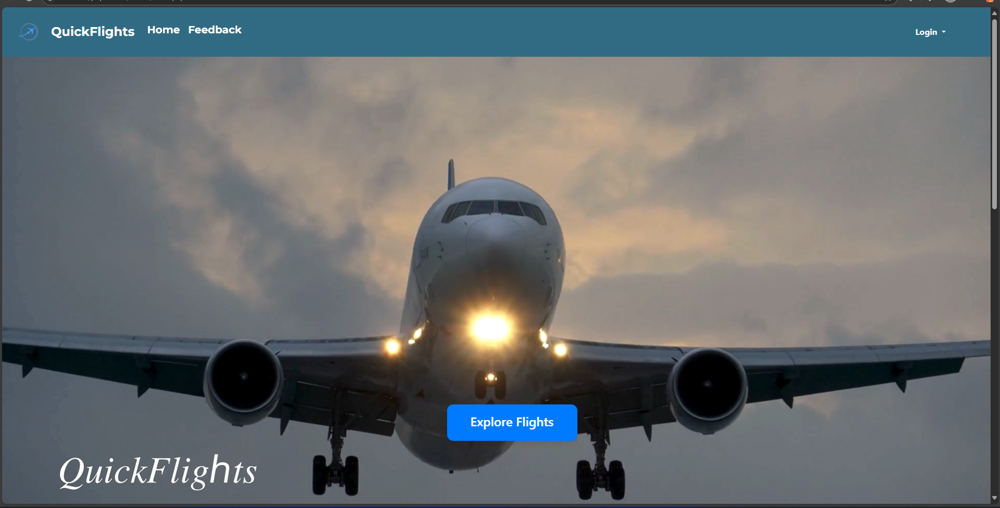

# ✈️ Online Flight Booking System

A complete web-based flight booking system that allows users to search for flights, book tickets, and manage their bookings. Designed for both travelers and admins, the system supports real-time flight listings, user authentication, seat selection, and more.



## 📌 Features

### For Users:
- 🔍 Search and filter available flights
- ✈️ Book flights with live seat availability
- 📅 View upcoming and past bookings
- 👤 User login and registration system
- 🧾 View ticket summary and booking details

### For Admin:
- 🧑‍💼 Admin dashboard to manage flights and bookings
- ➕ Add, update, or delete flights
- 📊 View and filter all bookings
- 💺 Manage available seats and flight statuses

## 🛠️ Tech Stack

| Layer        | Technology Used                     |
|--------------|--------------------------------------|
| Frontend     | HTML, CSS, JavaScript                |
| Backend      | PHP                                  |
| Database     | MySQL                                |
| Server       | Apache (XAMPP recommended for local) |

## 💻 Installation

1. Clone the repository  
   ```bash
   git clone https://github.com/ShambhaviBorkar/Online-Flight-Booking-System.git
2. Set up the project locally

   • Open with XAMPP (or any LAMP/WAMP stack)
   
   • Move the folder to htdocs directory
   
   • Start Apache and MySQL from XAMPP

3. Import the database

   • Open phpMyAdmin
   
   • Create a database (e.g., flight_booking)
   
   • Import the SQL file located at database/flight_booking.sql

4. Update config file

   • Go to includes/db.php
   
   • Set your local database username/password (default: root / no password)

5. Run the project
   Open your browser and go to:
   ```bash
   http://localhost/Online-Flight-Booking-System/
   ```
📦 Folder Structure
```bash
Online-Flight-Booking-System/
│
├── css/                 # Stylesheets
├── js/                  # JavaScript files
├── admin/               # Admin panel
├── includes/            # DB config and PHP logic
├── user/                # User dashboard and bookings
├── index.php            # Homepage
└── ...
```
## 🙋‍♀️ Authors
Gauri Gotad

GitHub: [@Gaurigotad](https://github.com/Gaurigotad)

Shambhavi Borkar

GitHub: [@ShambhaviBorkar](https://github.com/ShambhaviBorkar)
